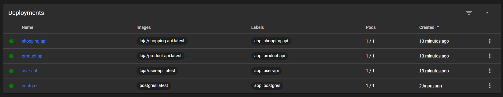

## Kubernetes

### Configuração do Kubernetes Dashboard

1. **Implante o Kubernetes Dashboard:**

   Execute o comando abaixo para implantar o Kubernetes Dashboard no cluster:

   ```bash
   kubectl apply -f https://raw.githubusercontent.com/kubernetes/dashboard/v2.4.0/aio/deploy/recommended.yaml
   ```

   Isso baixará e aplicará a configuração recomendada para o Kubernetes Dashboard.

2. **Crie um usuário administrador:**

   Para acessar o Dashboard com privilégios administrativos, crie um arquivo chamado `create-user.yml` com o seguinte conteúdo:

   ```yaml
   apiVersion: v1
   kind: ServiceAccount
   metadata:
     name: loja-admin
     namespace: kube-system
   ---
   apiVersion: rbac.authorization.k8s.io/v1
   kind: ClusterRoleBinding
   metadata:
     name: loja-admin
   roleRef:
     apiGroup: rbac.authorization.k8s.io
     kind: ClusterRole
     name: cluster-admin
   subjects:
   - kind: ServiceAccount
     name: loja-admin
     namespace: kube-system
   ```

   Em seguida, aplique esse arquivo para criar o usuário administrador:

   ```bash
   kubectl create -f create-user.yml
   ```

3. **Gere manualmente um token para a conta de serviço:**

   Para autenticar no Dashboard, é necessário um token associado à conta de serviço `loja-admin`. Crie um arquivo chamado `loja-admin-token.yaml` com o seguinte conteúdo:

   ```yaml
   apiVersion: v1
   kind: Secret
   metadata:
     name: loja-admin-token
     namespace: kube-system
     annotations:
       kubernetes.io/service-account.name: loja-admin
   type: kubernetes.io/service-account-token
   ```

   Aplique o arquivo ao cluster:

   ```bash
   kubectl apply -f loja-admin-token.yaml
   ```

4. **Obtenha o token de autenticação:**

   Depois de criar o segredo, obtenha o token que será usado para acessar o Kubernetes Dashboard:

   ```bash
   kubectl -n kube-system describe secret loja-admin-token
   ```

   Copie o token que aparece na seção `token:`.

5. **Inicie o proxy do Kubernetes:**

   Para acessar o Dashboard a partir do seu navegador, inicie o proxy do Kubernetes:

   ```bash
   kubectl proxy
   ```

6. **Acesse o Kubernetes Dashboard:**

   Com o proxy ativo, abra o seguinte URL no seu navegador:

   ```
   http://localhost:8001/api/v1/namespaces/kubernetes-dashboard/services/https:kubernetes-dashboard:/proxy/
   ```

7. **Autentique-se com o token:**

   Quando solicitado, cole o token obtido no passo 4 para autenticar como `loja-admin` no Kubernetes Dashboard.


### Script Bash

Crie um arquivo chamado `deploy-k8s.sh` no diretório raiz dos seus microsserviços com o seguinte conteúdo:

```bash
#!/bin/bash

# Função para aplicar arquivos YAML
apply_k8s_resources(){
  local dir=$1

  # Verifica se o arquivo deployment.yaml existe e aplica
  if [ -f "$dir/deploy/deployment.yaml" ]; then
      kubectl apply -f "$dir/deploy/deployment.yaml"
    fi

    # Verifica se o arquivo service.yaml existe e aplica
    if [ -f "$dir/deploy/service.yaml" ]; then
      kubectl apply -f "$dir/deploy/service.yaml"
    fi

    # Verifica se o arquivo configmap.yaml existe e aplica (apenas para shopping-api)
    if [ -f "$dir/deploy/configmap.yaml" ]; then
      kubectl apply -f "$dir/deploy/configmap.yaml"
    fi
}

# Lista os diretórios dos microsserviços
services=("user-api" "product-api" "shopping-api")

# Itera sobre cada serviço e aplica os recursos Kubernetes
for service in "${services[@]}"; do
  apply_k8s_resources $service
done
```

### Executando o Script

1. **Dê permissão de execução ao script:**

   No terminal, execute:

   ```bash
   chmod +x deploy-k8s.sh
   ```

2. **Execute o script:**

   Ainda no terminal, execute:

   ```bash
   ./deploy-k8s.sh
   ```



### Explicação

- **Função `apply_k8s_resources`:** A função verifica se os arquivos `deployment.yaml`, `service.yaml`, e `configmap.yaml` existem em cada diretório especificado e aplica-os usando `kubectl apply`.

- **Lista `services`:** Contém os nomes dos diretórios onde os microsserviços estão localizados. Você pode ajustar essa lista conforme necessário.

- **Iteração:** O script percorre cada diretório na lista e chama a função `apply_k8s_resources`, aplicando os arquivos YAML encontrados.

### Vantagens

- **Manutenção Facilitada:** Cada microsserviço mantém seus próprios arquivos de configuração.
- **Execução Única:** Você só precisa rodar o script uma vez para aplicar todos os recursos.

Isso deve simplificar o processo de implantação dos seus microsserviços sem precisar unificar todos os arquivos YAML.